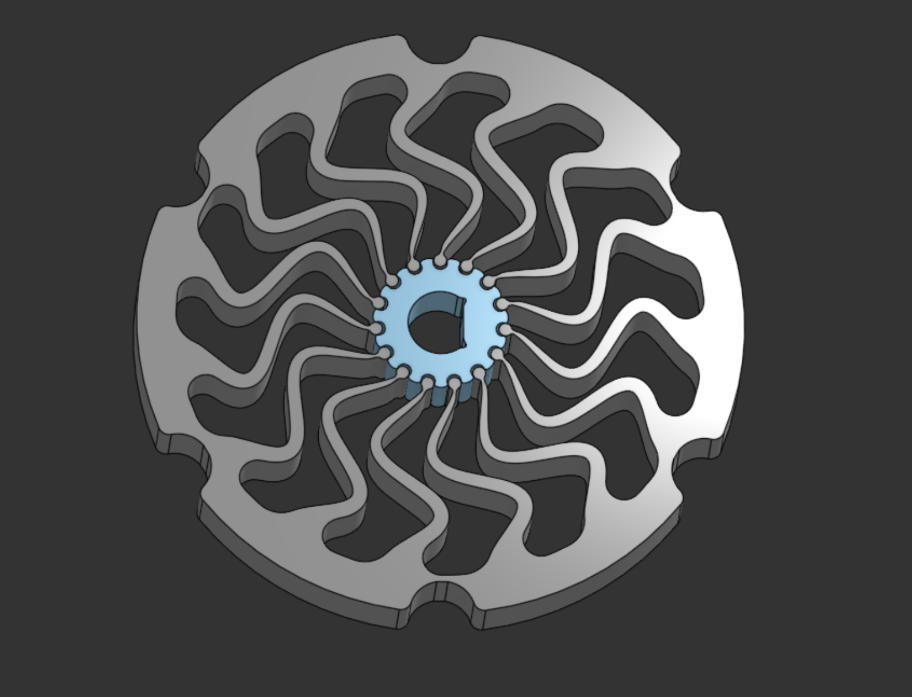

# Spring design tool to STEP script

This script uses the output of: <https://github.com/neurobionics/spring-design-tool>

To convert the exported csv's to step files or OpenScad scripts using FreeCad.

## Requirements

You need uv installed and python 13+ though other versions might work

To install deps run

```bash
uv sync
```

## Running

To run the program you need the following in the same directory as `build_spring_cam_v4.py`

- outer_m.csv
- inner_m.csv
- cam_profile_m.csv

then run

```bash
uv run build_spring_cam_v4.py --separate-step
```

This will output the generated STEP files in `/generated_spring_cam`.

## Demo



Exported spring imported into onshape with some minor cleaning.

## Notice/Disclaimer

AI was used **HEAVILY** to create this script, bear this in mind when using this system and expect there to potentially significant issues. This was made as a one off script and does not represent the standard quality of my work.
